# WSUTComp Player Guide

This guide explains every option in the in-game **UTComp** configuration menu. The
menu is added by the WSUTComp mutator (`MutUTComp`) and lets you customize skins,
crosshairs, hitsounds, the HUD, and much more. All of your choices are saved to your
local config, so they persist between matches and servers.

## Opening the menu

Press **F5** to open the UTComp menu. (During warmup, F5 also readies you up.)

Press **ESC** to close the menu at any time. Changes are applied and saved
immediately as you make them - there is no separate "save" button for most options.

## The tab bar

Every screen shares the same row of tabs across the top. Click a tab to jump to that
section:

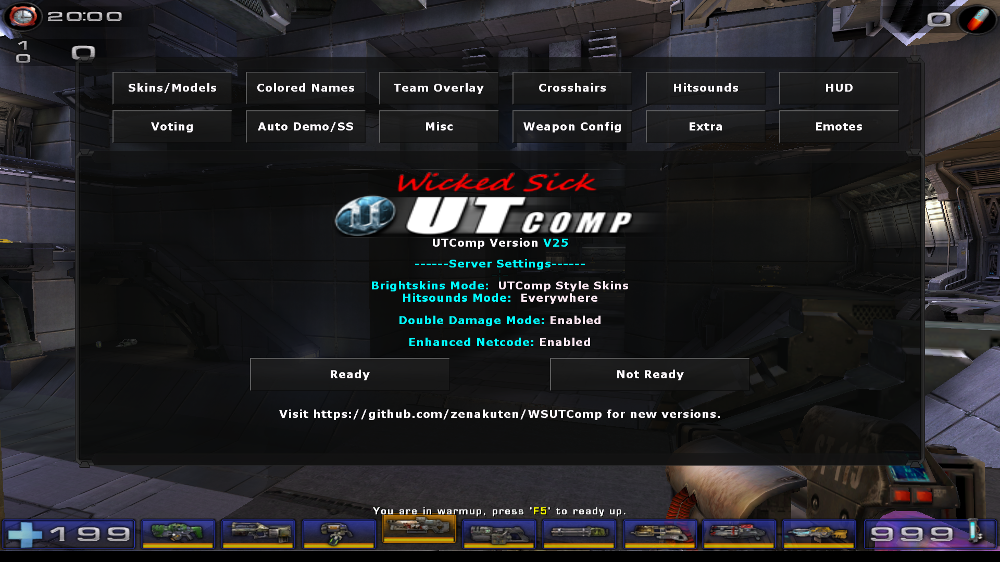

| Tab | What it configures |
|-----|--------------------|
| **Skins/Models** | Bright/team skins, player models, clan skins |
| **Colored Names** | Multi-color your player name; where colored names appear |
| **Team Overlay** | The on-screen list of teammates, their names, and locations |
| **Crosshairs** | Build a custom stacked crosshair from the crosshair factory |
| **Hitsounds** | Sounds played when you damage an enemy or teammate |
| **HUD** | See teammates through walls / on the minimap (team radar) |
| **Voting** | Map / game-type / settings voting (server dependent) |
| **Auto Demo/SS** | Automatically record demos and take end-of-match screenshots |
| **Misc** | Scoreboard, footsteps, eye-height, enhanced netcode |
| **Weapon Config** | Team-colored projectiles (rockets, bio, flak, shock) |
| **Extra** | Damage indicators, awards, ghost color, 3rd-person camera |
| **Emotes** | Emoticons you can send in chat |

The center of the main page shows the mod version (e.g. **UTComp Version V24**) and the
current **Server Settings** (Brightskins mode, Hitsounds mode, Double Damage, Enhanced
Netcode), plus **Ready / Not Ready** buttons for warmup.

> **Server can override you.** Many features are gated by the server. When a server
> disables something, the related control is greyed out (often with a "Server
> disabled" hint) or its label changes to note it is disabled. Your saved preference
> is kept and takes effect again on servers that allow it.

---

## Skins / Models

Controls how players are re-skinned into bright, easy-to-read team colors, and which
player models are shown. The page is split into two columns - **Red Team** on the left
and **Blue Team** on the right - each with a live rotating model preview. A separate
pair of previews shows the two **Spawn protected** appearances.

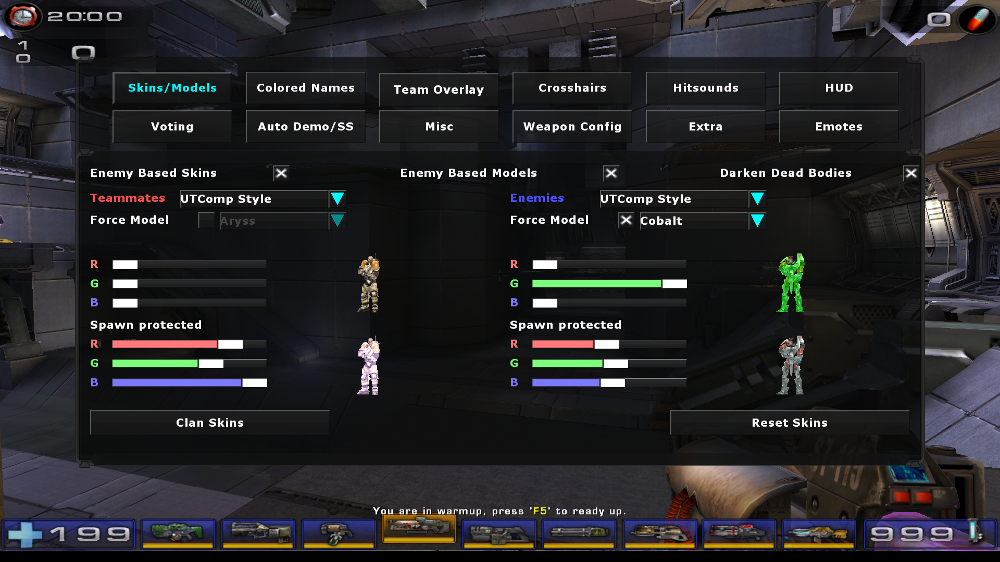

**Top row of toggles**

- **Enemy Based Skins** - Color players by *your* team vs. the *enemy* team instead of
  by fixed Red/Blue. With this on, the two columns read "Teammates / Enemies" rather
  than "Red Team / Blue Team."
- **Enemy Based Models** - The same idea, but for forced *models* rather than skin
  color.
- **Darken Dead Bodies** - Dims dead players so corpses are less distracting.

**Per-team controls (each column)**

- **Skin style (drop-down)** - How that team's skin is recolored:
  - **Epic Style** - Standard Epic team skin.
  - **Brighter Epic Style** - A brighter version (server may disable).
  - **UTComp Style** - Fully custom RGB coloring using the sliders below (server may
    disable).
- **Force Model** - A check box plus a model drop-down. When checked, everyone on that
  team is forced to use the chosen model (Aryss, Brutalis, Cobalt, Corrosion, ... the
  standard UT2004 roster) instead of their own.
- **Red / Green / Blue sliders** - Shown only for **UTComp Style**; dial in any additive
  color (Epic styles use their fixed preset instead, so the sliders are hidden).
- **Spawn protected (R/G/B)** - A second set of sliders that colors players while they
  are spawn-protected. These are always available regardless of skin style.

**Clan Skins** (bottom-left button) - Opens a panel for per-player overrides so a
specific rival stands out. See below. The button toggles to **Hide Clan Skins** while
the panel is open.

**Reset Skins** (bottom-right button) - Restores the default skin/model settings.

### Clan Skins

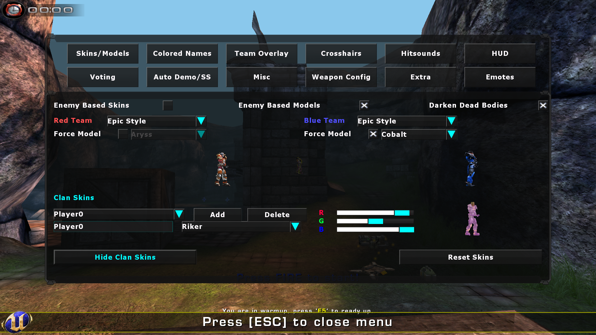

The Clan Skins panel lets you give a named player their own color and model:

1. Use **Add** to create a new entry and **Delete** to remove the selected one.
2. Pick the entry from the drop-down, then type the player's exact name in the edit box.
3. Choose a model from the model drop-down and set the **R / G / B** sliders for their
   color. A preview of the clan skin appears on the right.

### Forcing a model

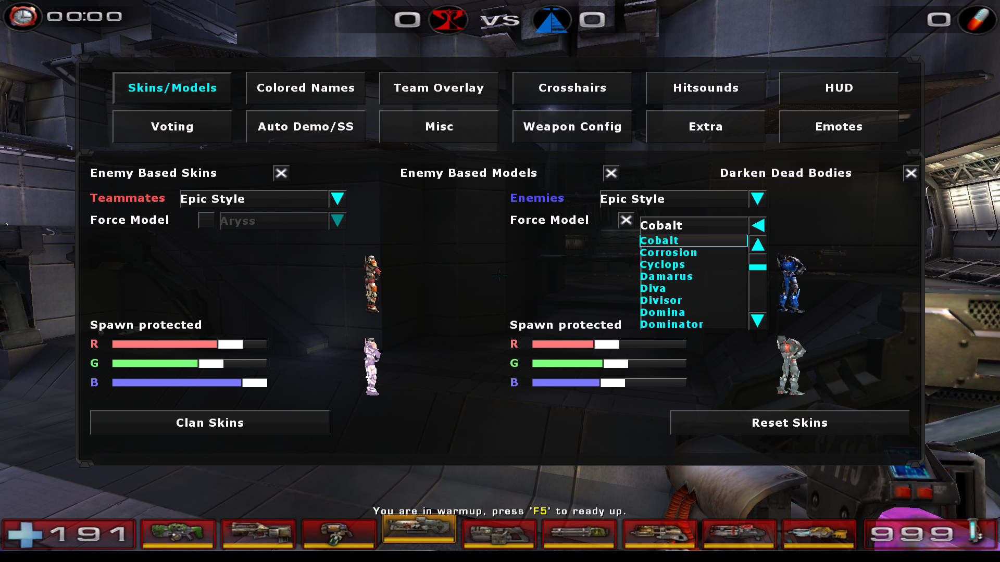

Tick **Force Model** for a team and pick any character from the drop-down (Cobalt,
Corrosion, Cyclops, Damarus, Diva, ...). Everyone on that team will then appear as that
single model, making friend/foe recognition instant.

### Epic vs. UTComp style

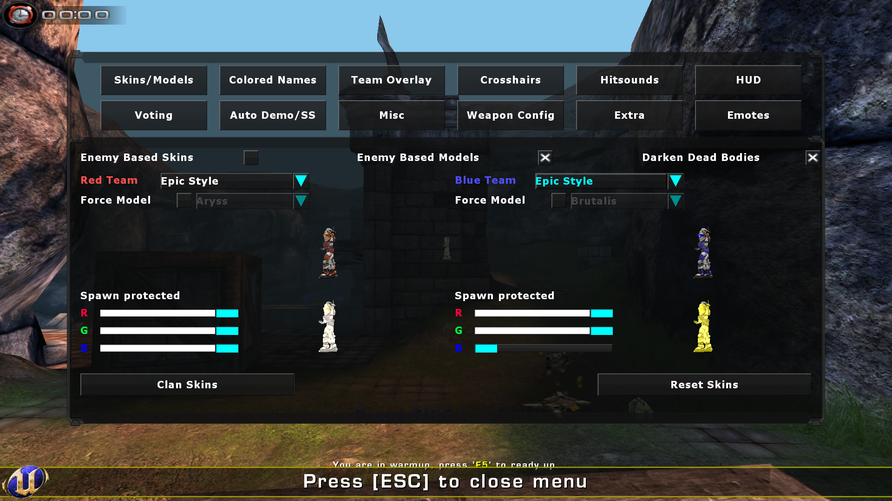

With **Epic Style** (or Brighter Epic Style) selected, the team keeps Epic's built-in
team coloring and the R/G/B sliders disappear - only the Spawn protected sliders remain.
Switch a team back to **UTComp Style** to get full RGB control over its color.

---

## Colored Names

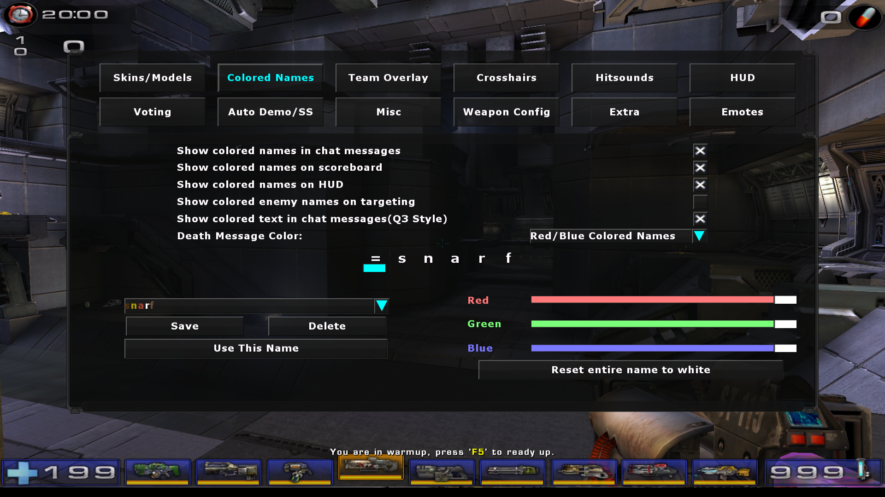

Gives your player name per-letter colors and controls where colored names are shown.

**Where colored names appear (check boxes)**

- **Show colored names in chat messages**
- **Show colored names on scoreboard**
- **Show colored names on HUD**
- **Show colored enemy names on targeting** - colors enemy names when you look at
  them.
- **Show colored text in chat messages (Q3 Style)** - enables Quake-3 style inline
  color codes in your chat text.

**Death Message Color (drop-down)** - How names look in the kill feed:
*Disabled*, *Colored Names*, or *Red/Blue Colored Names* (team-colored).

**Coloring your name**

1. Your name is shown letter-by-letter in the middle of the screen.
2. Use the **letter slider** directly under the name to select which letter you are
   editing (the small marker highlights the current letter).
3. Adjust the **Red / Green / Blue** sliders to color that letter. The preview updates
   live.
4. **Reset entire name to white** clears all coloring back to plain white.

**Saving name presets**

- **Save** - stores the current colored name as a preset in the drop-down list.
- **Delete** - removes the selected preset.
- **Use This Name** - applies the selected saved preset as your active colored name.

---

## Team Overlay

The team overlay is an on-screen panel that lists your teammates with their name,
location, and health. Everything except the enable box is greyed out until the
overlay is enabled (and the server allows it).

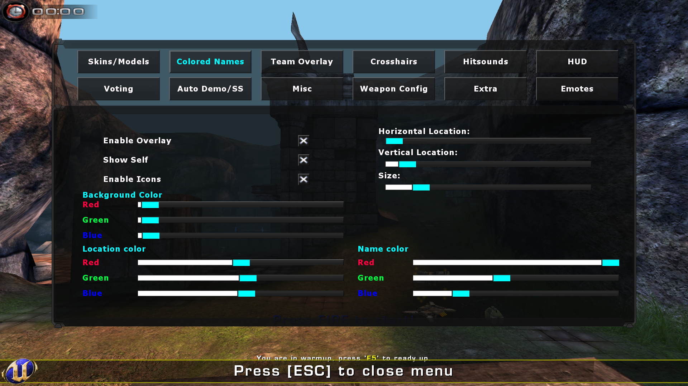

- **Enable Overlay** - master on/off switch.
- **Show Self** - include yourself in the list.
- **Enable Icons** - draw small icons next to entries.

**Position & size (right side)**

- **Horizontal Location** / **Vertical Location** - move the panel around the screen.
- **Size** - font size of the overlay text.

**Colors (RGB sliders)**

- **Background Color** - the panel's backdrop.
- **Location color** - the map-location text.
- **Name color** - the teammate name text.

**In game**, the overlay appears in the corner and updates live. It works across game
types - team deathmatch, CTF, and so on:

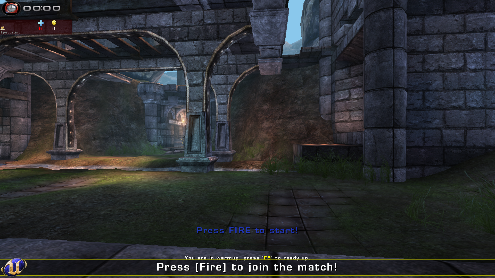

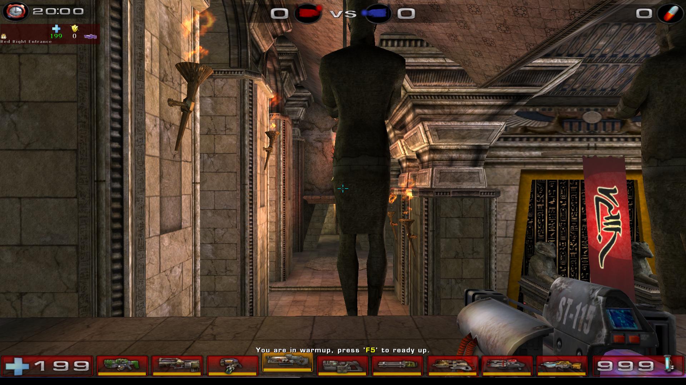

---

## Crosshairs

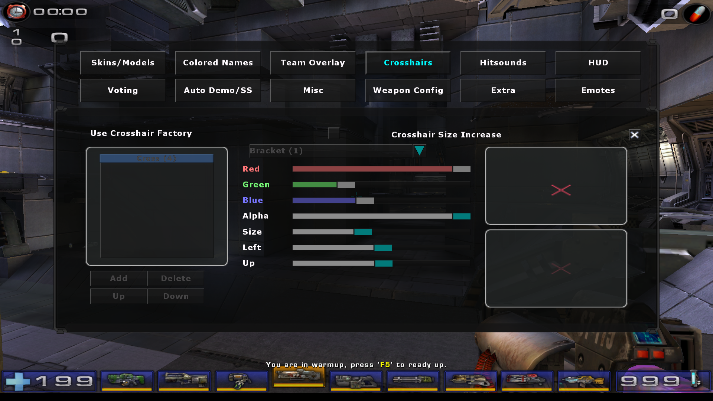

UTComp's **crosshair factory** lets you stack multiple crosshair images into one
custom crosshair, each with its own color, size, opacity, and offset.

- **Use Crosshair Factory** - master toggle. When off, the game's normal crosshair is
  used and the controls below are disabled.
- **Crosshair Size Increase** - enables dynamic size scaling.

**Building a crosshair**

1. The **list box** on the left shows the layers that make up your current crosshair.
2. The **drop-down** at the top picks which crosshair image a selected layer uses
   (game crosshairs plus UTComp shapes: circles, squares, diamonds, brackets/"L",
   crosses, horizontal/vertical lines, in several sizes).
3. **Add** appends a new layer; **Delete** removes the selected layer; **Up / Down**
   reorder layers.
4. With a layer selected, adjust its sliders:
   - **Red / Green / Blue** - layer color.
   - **Alpha** - opacity (0 = invisible, 255 = solid).
   - **Size** - scale of the image.
   - **Left** - horizontal offset from center.
   - **Up** - vertical offset from center.

The upper preview box shows the selected layer; the lower preview box shows the full
stacked crosshair as it will appear in game.

---

## Hitsounds

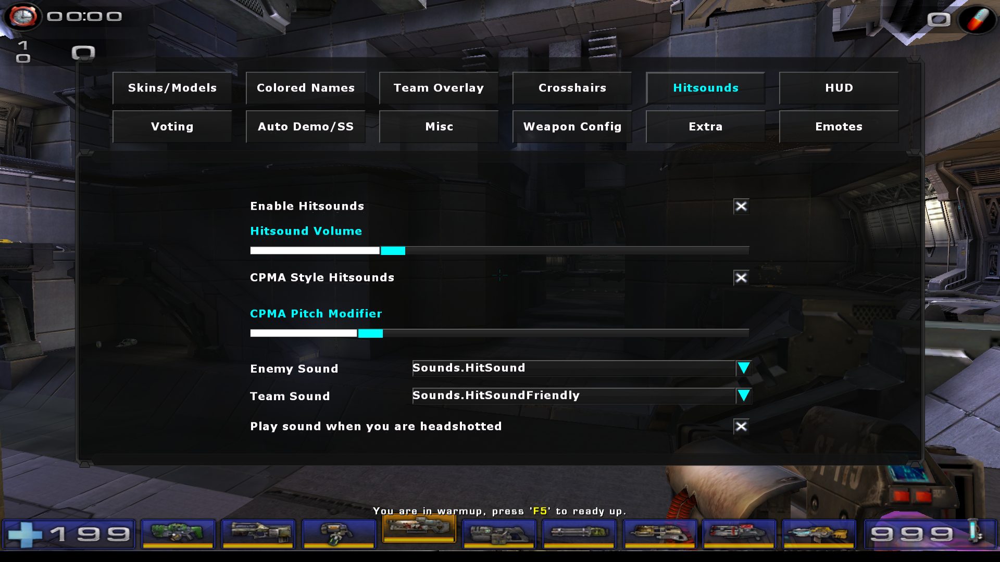

Plays a sound when your shots land, giving you audio feedback on hits.

- **Enable Hitsounds** - master toggle (server must also allow hitsounds).
- **Hitsound Volume** - how loud the hit feedback is.
- **CPMA Style Hitsounds** - when on, the pitch of the hit sound rises with the amount
  of damage dealt (CPMA/Quake style). Enables the pitch slider below.
- **CPMA Pitch Modifier** - how much the pitch changes with damage.
- **Enemy Sound** - the sound played when you hit an enemy.
- **Team Sound** - the sound played when you hit a teammate.
- **Play sound when you are headshotted** - plays a distinct sound when *you* take a
  headshot.

---

## HUD (Team Radar)

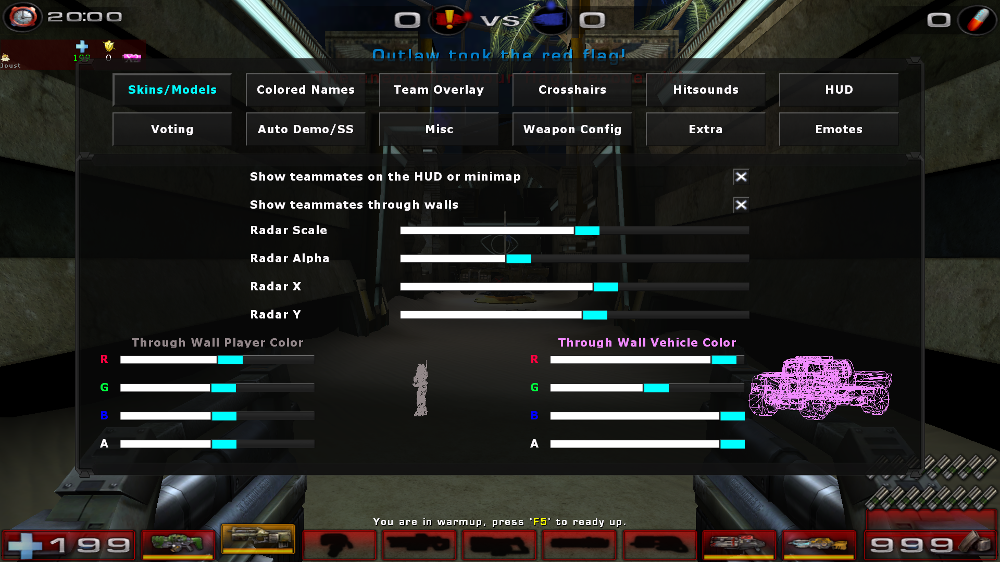

The HUD tab controls **team radar** - seeing teammates through walls and/or as dots on
the HUD/minimap. Both features are server-gated; if the server disables one, its
controls are hidden and the check box is disabled with a "Server disabled" hint.

- **Show teammates on the HUD or minimap** - draws teammates as dots on the minimap /
  HUD.
- **Show teammates through walls** - draws teammates' positions even when occluded.

**Minimap radar tuning**

- **Radar Scale** - size of the minimap radar.
- **Radar Alpha** - its opacity.
- **Radar X / Radar Y** - its position on screen.

**Through-Wall Player Color** (left R/G/B/A sliders) and **Through-Wall Vehicle Color**
(right R/G/B/A sliders) set the color and opacity used for teammates and their
vehicles. Wireframe previews on either side show the current colors.

---

## Voting

The Voting tab is a hub for casting votes while on a server. It opens on a **"Select
your voting type"** page with three buttons - **Change Map**, **Gametype**, and
**Settings** - each leading to one of the screens below. Buttons are disabled for any
vote type the server administrator has turned off, so what you see varies from server
to server.

### Change Map

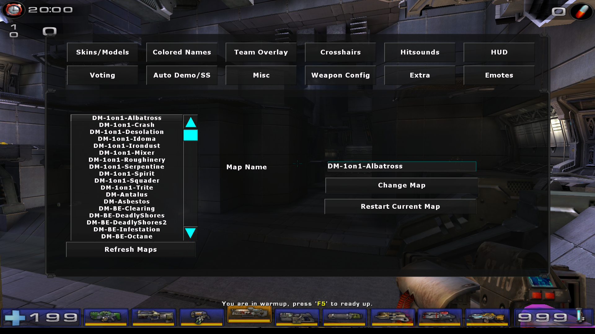

Pick a map from the scrollable list (or type its name in **Map Name**), then:

- **Change Map** - calls a vote to switch to the selected map.
- **Restart Current Map** - calls a vote to restart the map currently being played.
- **Refresh Maps** - reloads the map list.

### Gametype

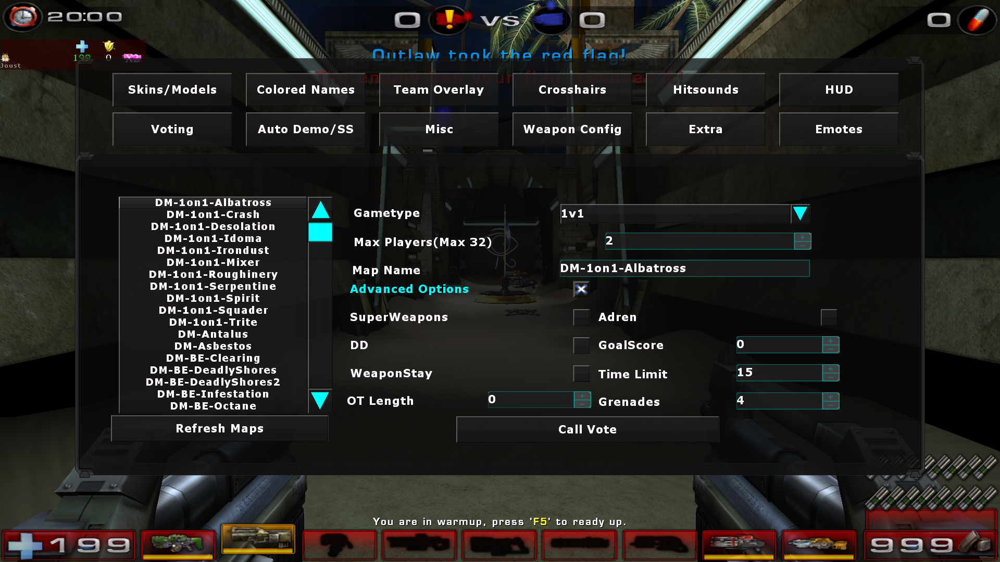

Sets up a vote for a whole new match:

- **Gametype** - the game mode to switch to (e.g. 1v1).
- **Max Players (Max 32)** - the player slot count.
- **Map Name** - which map to start on (also selectable from the list).
- **Advanced Options** - when checked, reveals the match settings below:
  **SuperWeapons**, **Adren**, **DD** (Double Damage), **WeaponStay**, **GoalScore**,
  **Time Limit**, **OT Length** (overtime), and **Grenades**.
- **Call Vote** - puts the configured game up for a vote.

### Settings

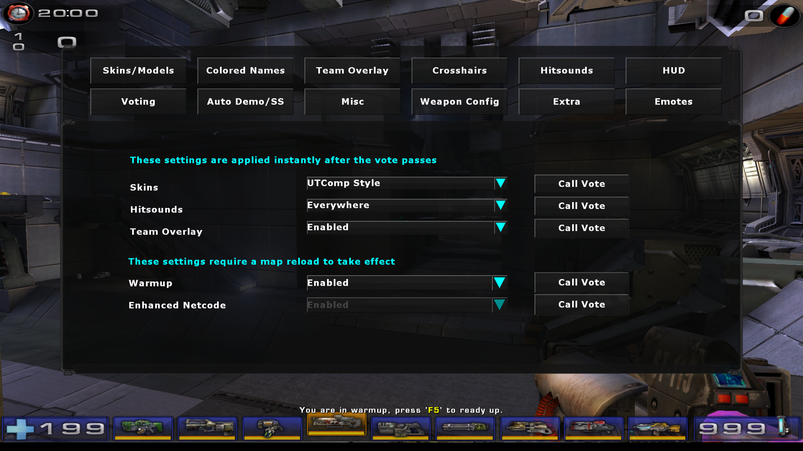

Vote to change individual match settings, each with its own **Call Vote** button.
Settings are grouped by how they take effect:

- **Applied instantly after the vote passes** - **Skins**, **Hitsounds**,
  **Team Overlay**.
- **Require a map reload to take effect** - **Warmup**, **Enhanced Netcode**.

---

## Auto Demo / SS

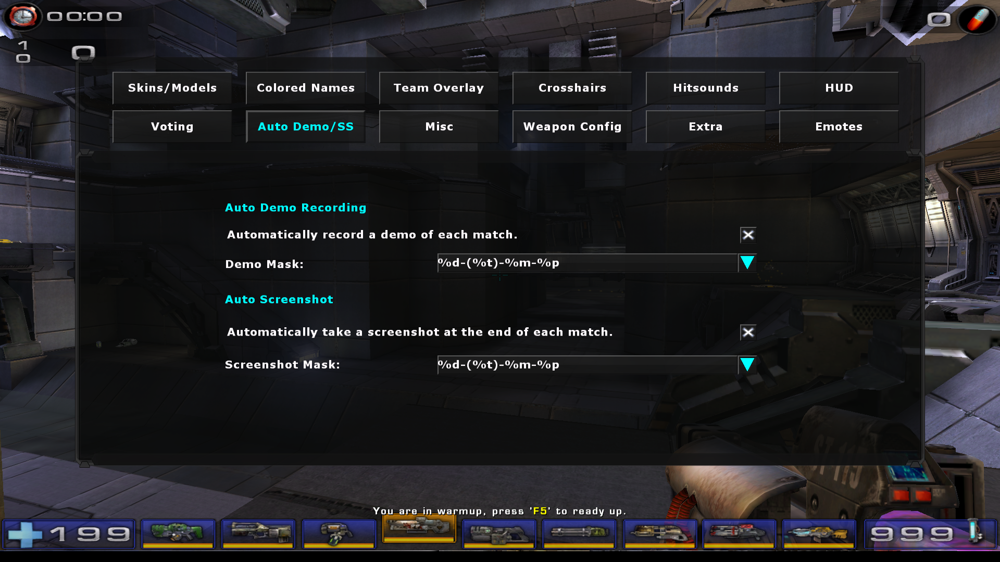

Automates recording and screenshots so you never forget to capture a match.

**Auto Demo Recording**

- **Automatically record a demo of each match** - starts a demo recording every match.
- **Demo Mask** - the filename template for saved demos (e.g. `%d-(%t)-%m-%p`).

**Auto Screenshot**

- **Automatically take a screenshot at the end of each match** - captures the final
  scoreboard.
- **Screenshot Mask** - the filename template for the screenshots.

The mask fields use substitution tokens (date, time, map, players, etc.) so each file
gets a unique, descriptive name.

---

## Misc

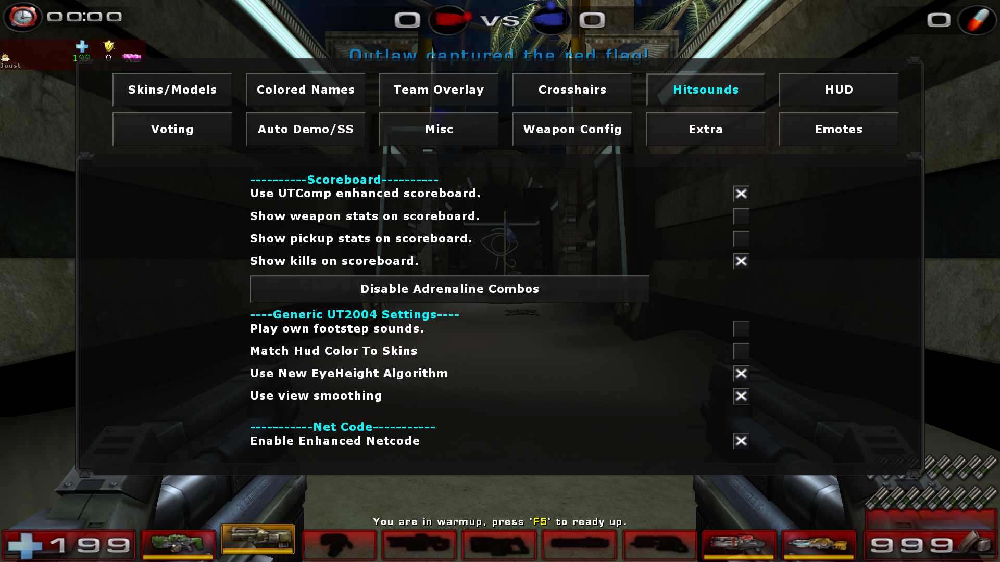

A grab bag of scoreboard, gameplay, and netcode options.

**Scoreboard**

- **Use UTComp enhanced scoreboard** - replaces the stock scoreboard with UTComp's.
  Turning this off also turns off the weapon/pickup stats below.
- **Show weapon stats on scoreboard** - per-weapon accuracy/damage stats.
- **Show pickup stats on scoreboard** - item-control stats.
- **Show kills on scoreboard** - show kill counts.
- **Disable Adrenaline Combos** - opens a sub-menu to enable/disable specific
  adrenaline combos (see below).

**Generic UT2004 Settings**

- **Play own footstep sounds** - hear your own footsteps. (Weapon bob must be off, and
  it takes effect after you respawn.)
- **Match Hud Color To Skins** - tints your HUD to match your chosen skin colors.
- **Use New EyeHeight Algorithm** - a smoother eye-height model when landing/moving.
  Recommended on.
- **Use view smoothing** - smooths the view when the new eye-height algorithm is
  active.

**Net Code**

- **Enable Enhanced Netcode** - turns on UTComp's improved hit-detection netcode. If
  the server has it disabled, the heading notes this and the check box is hidden.
  See `ping-compensation.md` for the technical details.

### Adrenaline Combos

The Misc menu also has a toggle for each adrenaline combo: **Enable Booster Combo**,
**Enable Invisibility Combo**, **Enable Speed Combo**, and **Enable Berserk Combo**.
Uncheck any combo you don't want to trigger.

---

## Weapon Config

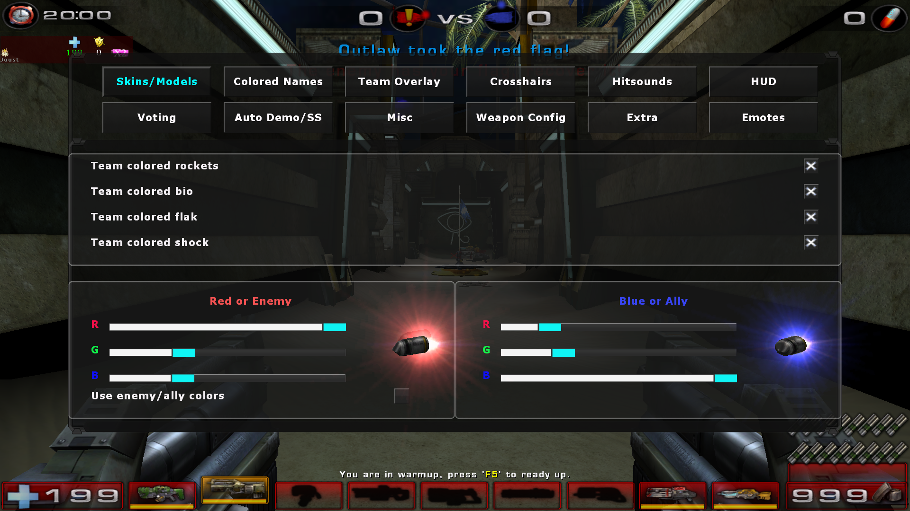

Adds team coloring to projectiles so you can instantly tell friendly fire from enemy
fire. Server-gated; disabled controls show a "Server disabled" hint.

**What to color (check boxes)**

- **Team colored rockets**
- **Team colored bio**
- **Team colored flak**
- **Team colored shock**

**Coloring**

- **Red or Enemy** (left) and **Blue or Ally** (right) each have **R / G / B**
  sliders, with a live spinning projectile preview.
- **Use enemy/ally colors** - switch from fixed Red/Blue to your-team vs. enemy-team
  coloring. When on, the left box colors enemies and the right box colors allies.

> Colors that are too dark are rejected (you'll see a "too dark" message) so
> projectiles always stay visible.

---

## Extra

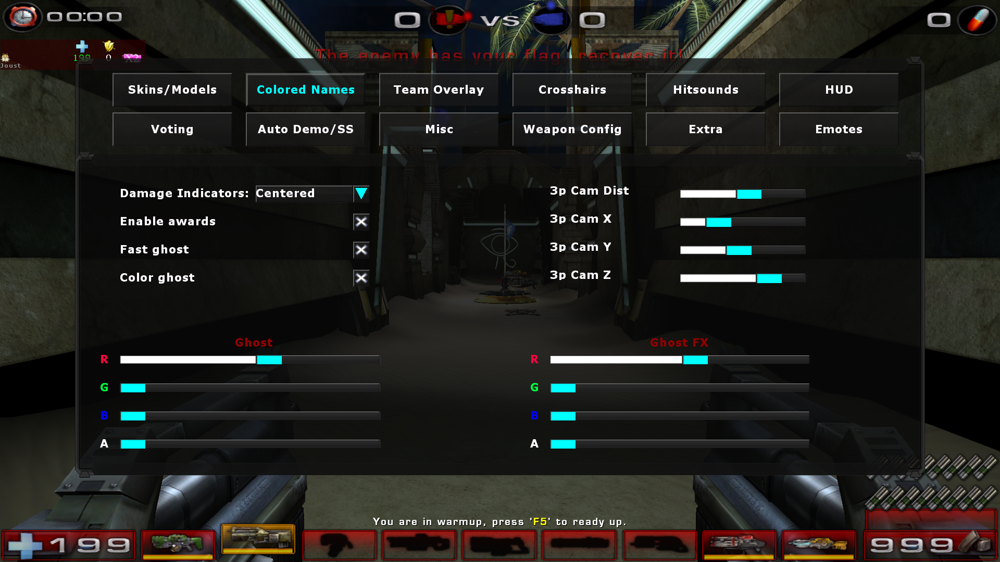

Miscellaneous visual extras.

- **Damage Indicators (drop-down)** - directional hit indicators when you take damage:
  *Disabled*, *Centered*, or *Floating*. (Server can disable this.)
- **Enable awards** - plays award sounds (e.g. air rocket, impressive shock combo).
- **Fast ghost** - dead players turn to a ghost immediately.
- **Color ghost** - use your configured ghost color instead of the default.

**Ghost / Ghost FX color** - two sets of **R / G / B / A** sliders that set the ghost
body color and its effect color.

**Third-person camera** (right side sliders)

- **3p Cam Dist** - camera distance behind your model.
- **3p Cam X / Y / Z** - fine world-space offset of the camera.

---

## Emotes

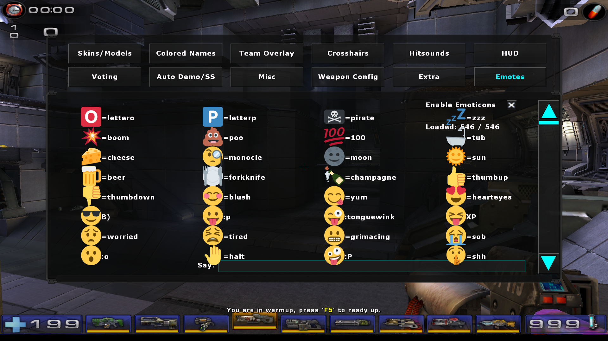

A picker for emoticons you can send in chat. Each emoji shows its chat code (for
example `=soap`, `=beer`, `=cookie`, `:p`).

- **Enable Emoticons** - master toggle for rendering emoticons.
- **Loaded: X / Y** - how many emoticon icons have downloaded from the server.
- Click any emoji to append its code to the **Say:** box, then press **Enter** to send
  the message to chat. Use the scroll bar (or the mouse wheel) to browse the full set.

---

*This guide reflects the options built by `UTComp_Menu_*` and stored in
`UTComp_Settings` / `UTComp_HUDSettings`. Some options depend on the server's
configuration and may be unavailable in a given match.*
