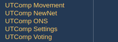
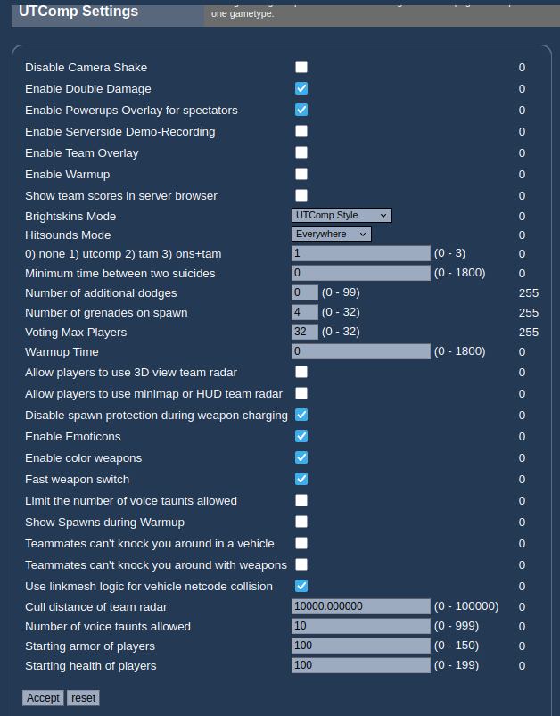
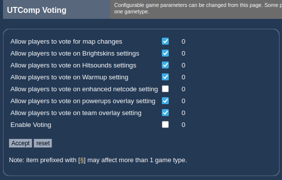
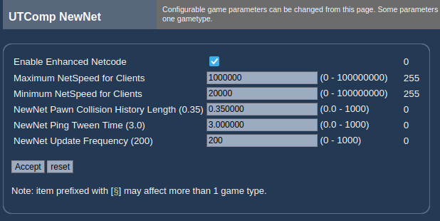
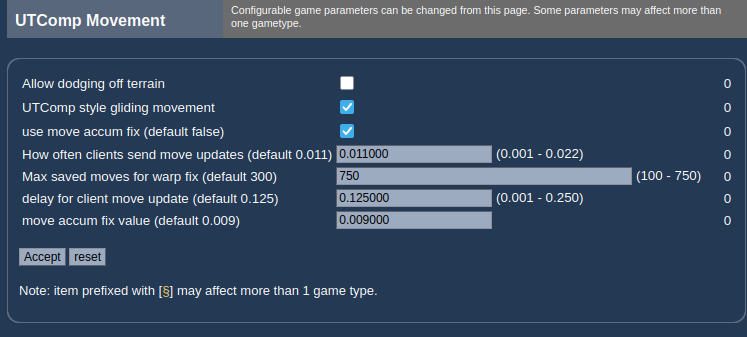
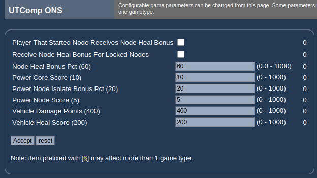

# WSUTComp Server Operator Guide

This guide documents every server‑side setting exposed by the **WSUTComp** mutator
(`MutUTComp`). These are the options built in the mutator's `FillPlayInfo` call, so they
appear in **WebAdmin** (and any other UT2004 settings UI) and can also be set directly in
the `[WSUTComp.MutUTComp]` section of the server's `UT2004.ini`.

## Where to find these settings

In WebAdmin, open the mutator's configuration and you'll see the UTComp settings split
across five pages:

| Page | Covers |
|------|--------|
| **UTComp Settings** | Core gameplay: brightskins, hitsounds, warmup, double damage, spawn loadout, team radar, etc. |
| **UTComp Voting** | Master voting switch and which in‑game vote types players may call |
| **UTComp NewNet** | Enhanced netcode (ping‑compensated hit detection) tuning |
| **UTComp Movement** | Client movement / anti‑warp tuning |
| **UTComp ONS** | Onslaught scoring bonuses |

Each row corresponds to a `config` property on `MutUTComp`; the property name is listed in
the tables below so you can edit `UT2004.ini` directly if you prefer.

> **The number on the right of each WebAdmin row is the required admin access level**, not
> a value. Most settings show `0` (any logged‑in admin); a few high‑impact numeric fields
> show `255`, meaning they are reserved for a higher privilege level.
>
> **The values in the screenshots are one server's configuration**, not necessarily the
> out‑of‑the‑box defaults. The "Default" column below lists the mutator's built‑in default.

---

## UTComp Settings

The main gameplay page.

**Skins & sounds**

| Setting | Property | Type | Default | Notes |
|---------|----------|------|---------|-------|
| Brightskins Mode | `EnableBrightSkinsMode` | Select | `UTComp Style` (3) | `0` Disabled, `1` Epic Style, `2` Brighter Epic Style, `3` UTComp Style. Sets the strongest skin mode players may use. |
| Hitsounds Mode | `EnableHitSoundsMode` | Select | `Everywhere` (2) | `0` Disabled, `1` Line of Sight, `2` Everywhere. |

**Warmup**

| Setting | Property | Type | Default | Notes |
|---------|----------|------|---------|-------|
| Enable Warmup | `bEnableWarmup` | Check | On | Pre‑match warmup with ready‑up (F5). |
| Warmup Time | `WarmupTime` | Text (0–1800) | 30 s | Length of the warmup period. |
| Warmup weapons mode | `EnableWarmupWeaponsMode` | Text (0–3) | 1 | Warmup loadout: `0` none, `1` UTComp, `2` TAM, `3` ONS+TAM. |
| Show Spawns during Warmup | `bShowSpawnsDuringWarmup` | Check | Off | Reveal spawn points during warmup. |

**Match rules**

| Setting | Property | Type | Default | Notes |
|---------|----------|------|---------|-------|
| Enable Double Damage | `bEnableDoubleDamage` | Check | On | Allow the Double Damage powerup. |
| Number of grenades on spawn | `NumGrenadesOnSpawn` | Text (0–32) | 4 | Grenades given at spawn (admin level 255). |
| Number of additional dodges | `MaxMultiDodges` | Text (0–99) | 0 | Extra multi‑dodges allowed (admin level 255). |
| Minimum time between two suicides | `SuicideInterval` | Text (0–1800) | 3 s | Anti‑suicide‑spam cooldown. |
| Starting health of players | `StartingHealth` | Text (0–199) | 100 | |
| Starting armor of players | `StartingArmor` | Text (0–150) | 0 | |
| Disable spawn protection during weapon charging | `bChargedWeaponsNoSpawnProtection` | Check | Off | Drop spawn protection while charging a weapon (e.g. shock combo). |
| Teammates can't knock you around with weapons | `bNoTeamBoosting` | Check | Off | Disables weapon‑based team boosting. |
| Teammates can't knock you around in a vehicle | `bNoTeamBoostingVehicles` | Check | Off | Disables vehicle‑based team boosting. |
| Voting Max Players | `ServerMaxPlayers` | Text (0–32) | 32 | Max‑players value used when a gametype vote is called (admin level 255). |

**Client features & UI**

| Setting | Property | Type | Default | Notes |
|---------|----------|------|---------|-------|
| Enable Team Overlay | `bEnableTeamOverlay` | Check | Off | Allow the teammate name/location overlay. |
| Enable Powerups Overlay for spectators | `bEnablePowerupsOverlay` | Check | On | Powerup timers shown to spectators. |
| Enable Serverside Demo‑Recording | `bEnableAutoDemoRec` | Check | Off | Server records a demo of each match. |
| Enable Emoticons | `bEnableEmoticons` | Check | On | Allow chat emoticons. |
| Enable color weapons | `bAllowColorWeapons` | Check | On | Allow team‑colored projectiles. |
| Fast weapon switch | `bFastWeaponSwitch` | Check | On | Instant weapon switching. |
| Disable Camera Shake | `bDisableCameraShake` | Check | Off | Suppresses explosion/weapon camera shake. |
| Show team scores in server browser | `bShowTeamScoresInServerBrowser` | Check | On | Publishes live team scores to the browser. |
| Limit the number of voice taunts allowed | `bLimitTaunts` | Check | Off | Enables the taunt cap below. |
| Number of voice taunts allowed | `TauntCount` | Text (0–999) | 10 | Cap applied when limiting is on. |

**Team radar** (players still opt in from their own HUD menu)

| Setting | Property | Type | Default | Notes |
|---------|----------|------|---------|-------|
| Allow players to use 3D view team radar | `bAllowTeamRadar` | Check | Off | See‑through‑walls teammate markers. |
| Allow players to use minimap or HUD team radar | `bAllowTeamRadarMap` | Check | Off | Teammate dots on the minimap/HUD. |
| Cull distance of team radar | `TeamRadarCullDistance` | Text (0–100000) | 10000 | Max range at which radar markers draw. |

**Vehicles**

| Setting | Property | Type | Default | Notes |
|---------|----------|------|---------|-------|
| Use linkmesh logic for vehicle netcode collision | `bUseLinkMesh` | Check | On | Improves vehicle hit collision under enhanced netcode. |

---

## UTComp Voting

Controls in‑game voting. **`Enable Voting` is the master switch** — the individual
allow‑toggles below only take effect when it is on. These correspond to the vote types
players reach from the in‑game **Voting** tab.

| Setting | Property | Type | Default |
|---------|----------|------|---------|
| Enable Voting | `bEnableVoting` | Check | Off |
| Allow players to vote for map changes | `bEnableMapVoting` | Check | On |
| Allow players to vote on Brightskins settings | `bEnableBrightskinsVoting` | Check | On |
| Allow players to vote on Hitsounds settings | `bEnableHitsoundsVoting` | Check | On |
| Allow players to vote on Warmup setting | `bEnableWarmupVoting` | Check | On |
| Allow players to vote on team overlay setting | `bEnableTeamOverlayVoting` | Check | On |
| Allow players to vote on powerups overlay setting | `bEnablePowerupsOverlayVoting` | Check | On |
| Allow players to vote on enhanced netcode setting | `bEnableEnhancedNetcodeVoting` | Check | Off |

> Gametype voting also has a master switch, `bEnableGametypeVoting` (default on), which is
> only usable when both voting and map voting are enabled.

---

## UTComp NewNet

Tuning for the **enhanced netcode** (ping‑compensated / "NewNet" hit detection). Leave
these at their defaults unless you understand the trade‑offs; see `ping-compensation.md`
for the technical background.

| Setting | Property | Type | Default | Notes |
|---------|----------|------|---------|-------|
| Enable Enhanced Netcode | `bEnableEnhancedNetcode` | Check | On | Master switch for NewNet hit detection. |
| Maximum NetSpeed for Clients | `MaxNetSpeed` | Text (0–100000000) | 100000000 | Upper clamp on client netspeed (admin level 255). |
| Minimum NetSpeed for Clients | `MinNetSpeed` | Text (0–100000000) | 10000 | Lower clamp on client netspeed (admin level 255). |
| NewNet Pawn Collision History Length | `PawnCollisionHistoryLength` | Text (0–1000) | 0.35 | Seconds of position history kept for rewind. |
| NewNet Ping Tween Time | `PingTweenTime` | Text (0–1000) | 3.0 | Smoothing window for a client's measured ping. |
| NewNet Update Frequency | `NewNetUpdateFrequency` | Text (0–1000) | 200 | Position‑history sampling rate. |

---

## UTComp Movement

Client movement and anti‑warp tuning. These affect all game types.

| Setting | Property | Type | Default | Notes |
|---------|----------|------|---------|-------|
| UTComp style gliding movement | `bKeepMomentumOnLanding` | Check | On | Preserves momentum on landing (classic UTComp feel). |
| Allow dodging off terrain | `bAllowTerrainDodge` | Check | Off | Permits dodging off terrain surfaces. |
| How often clients send move updates | `NetMoveDelta` | Text (0.001–0.022) | 0.011 | Lower = more frequent updates, more bandwidth. |
| Max saved moves for warp fix | `MaxSavedMoves` | Text (100–750) | 750 | Move history used to correct warping. (Label reads "default 300"; the current built‑in default is 750.) |
| delay for client move update | `MaxResponseTime` | Text (0.001–0.250) | 0.125 | Client move‑update response delay. |
| use move accum fix | `bMoveErrorAccumFix` | Check | Off | Enables the move‑error accumulation fix. |
| move accum fix value | `MoveErrorAccumFixValue` | Text (0.001–0.018) | 0.009 | Tolerance used by the accum fix. |

---

## UTComp ONS

Scoring bonuses for **Onslaught**. Ignored on non‑ONS game types. Each value's built‑in
default is shown in parentheses in the WebAdmin label.

| Setting | Property | Type | Default | Notes |
|---------|----------|------|---------|-------|
| Power Core Score | `PowerCoreScore` | Text (0–1000) | 10 | Points for damaging/destroying the enemy power core. |
| Power Node Score | `PowerNodeScore` | Text (0–1000) | 5 | Points for building/destroying a node. |
| Power Node Isolate Bonus Pct | `NodeIsolateBonusPct` | Text (0–1000) | 20 | Bonus % for isolating an enemy node. |
| Vehicle Damage Points | `VehicleDamagePoints` | Text (0–1000) | 400 | Damage threshold rewarded for anti‑vehicle work. |
| Vehicle Heal Score | `VehicleHealScore` | Text (0–1000) | 200 | Heal threshold rewarded for repairing vehicles. |
| Node Heal Bonus Pct | `NodeHealBonusPct` | Text (0–1000) | 60 | Bonus % for healing a node. |
| Receive Node Heal Bonus For Locked Nodes | `bNodeHealBonusForLockedNodes` | Check | Off | Grant the heal bonus even on locked nodes. |
| Player That Started Node Receives Node Heal Bonus | `bNodeHealBonusForConstructor` | Check | Off | Credit the node's original builder. |

---

*This guide reflects the settings registered by `MutUTComp.FillPlayInfo`. Values shown in
the screenshots are illustrative; the Default column lists each property's built‑in
default. After changing settings, a map change (or server restart) may be required for
some to take effect.*
